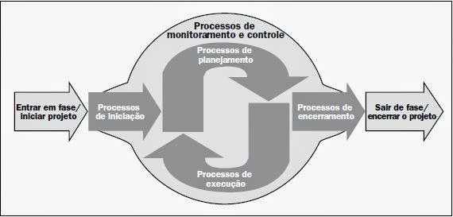

# Fundamentos de ciclo de vida de projeto

## Informação

**disciplina** : Gerencimento de projetos

**autor** : Leonardo Ataide Minora

**texto** : [Ciclo de vida de projeto](https://sites.google.com/site/gerenciadeprojetosdeti/aulas-1/3---ciclo-de-vida-do-projeto-e-processos-de-gestao-de-projeto)

## Resumo

- **processo** : é uma sequência de atividades, planejadas ou não, para se alcançar um objetivo definido.
- **ciclo de vida** : é definido pelas fases de um processo.
- **fases** : tarefas agrupadas/ordenadas para se alcançar um deternimado objetivo (entrega).
- **processos macro** : são tarefas que tem um macro objetivo
  - segundo PMI/PMBOK, são:
    1. **iniciação** : atividades para definir um novo projeto ou uma nova fase de um projeto
    2. **planejamento** : atividades para definir os objetivos, o escopo (requisitos), prazo, planejamento de fases/atividades (macro) de um projeto novo ou de fase de um projeto
    3. **execução** : atividades definidas na fase de planejamento
    4. **controle e monitoramento** : atividades para acompanhar, revisar e regular o progresso e desempenho do projeto.
    5. **encerramento** : atividades para finalizar ou ecerrar o projeto ou a fase.

## Pergunta
- Qual a relação entre o grupo de processos do PMI/PMBOK e o ciclo de vida do Scrum?
