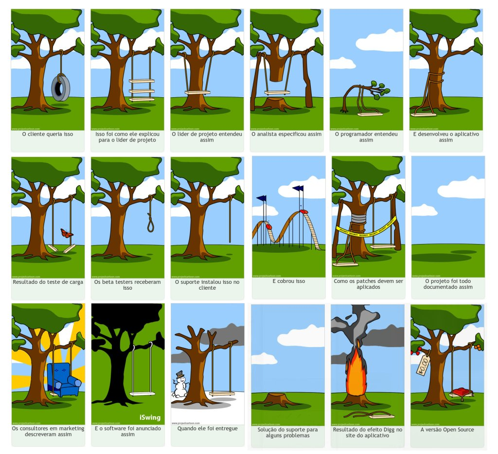

# Resumo sobre Conceitos fundamentais de projetos

**Autor do resumo**: Leonardo A. Minora

## Resumo

**o que é projeto?**

- esforço temporário empreendido para criar um produto, serviço ou resultado exclusivo
- tem formal ou informalmente: plano, requisitos ou necessidades, preço, riscos, viabilidade, restrições ou limitações, interessados

**PMI** e **PMBOK**

- _PMI_ Project Management Institute
- _PMBOK_ Project Managment Book Of Knowledgment

**Projeto** vs **Trabalho operacional**

- Operacional: carater repetitivo e período contínuo
- Projeto: carater único e período limitado

**Interessados**

- Interessados ou Stakeholders
  - Cliente/usuários, Patrocinador (sponsor), portfolio workers
  - Gerentes (software, projeto, marketing, infraestrutura de TI)
  - Escritório de projetos (project managmento office)
  - Parceiros comerciais
  - Equipe de projeto

**quando os projetos são necessários**

- quando a equipe se sente motivada a "executar" o projeto

**Fracasso**

- Não cumprimento de prazos
- Problemas de comunicação
- Escopo não definido adequadamente
- Recursos humanos insuficientes
- Riscos não avaliados corretamente
- Mudanças de prioridade constantes
- Estimativas incorretas ou sem fundamento
- Falta de definição de responsabilidades
- Problemas com fornecedores
- Retrabalho em função da falta de qualidade do produto
- Falta de competência para gerenciar projetos

_observação_:

- 78% das organizações costumam ter problemas com prazos dos projetos
- 64% das organizações costumam ter problemas com custos dos projetos
- **escopo**, veja figura abaixo

**Sucesso**

- Disciplina e rigor no uso de uma metodologia para gerenciar projeto
- Apoio da alta gerência ao projeto
- Especificação detalhada dos passos e ações para a implantação do projeto
- Definição clara do esopo
- Comunicação e participação de todos os envolvidos no projeto
- Recrutamento, seleção e treinamento do pessoal necessário para compor a equipe do projeto
- Alocação de recursos adequados para cada etapa do projeto
- Acompanhamento e feedback das informações referentes ao andamento e à conclusão do projeto
- Habilidade do gerente de projeto em lidar com crises inesperadas e mudança de planos
- Aceite do cliente ao receber o produto do projeto

_um projeto bem sucessido_

- Produziu todas as entregas planejadas
- Foi encerrado dentro do cronograma aprovado
- Foi executado dentro do orçamento aprovado
- Atingiu todas as especificaçdosões escopo e de qualidade
- Obteve a aceitação e a concordância do cliente